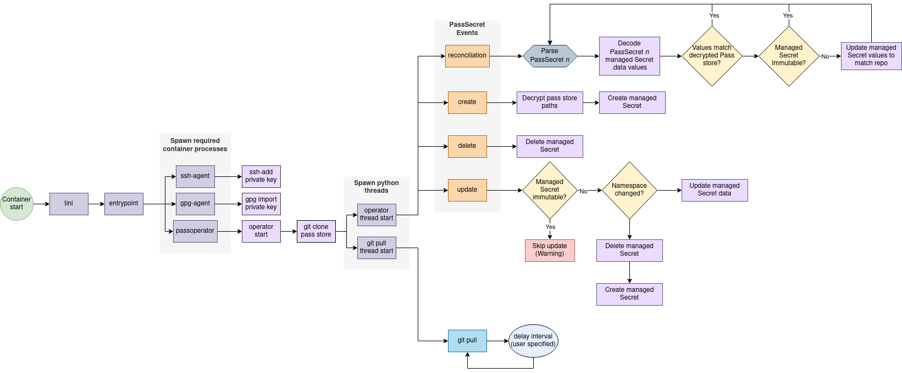

# `pass` secrets operator

A Kubernetes operator to sync and decrypt secrets from a password store ([pass](https://www.passwordstore.org/)) Git repository. This operator is proposed as a proof-of-concept and shouldn't be used in any production capacity.

While this approach to secrets management on Kubernetes is more technically challenging, the advantage is that we don't have to rely on a 3rd party SaaS platform, such as Vault or Doppler, to hold our secrets (the obvious benefits these platforms do provide, however, are better user and access management). We may also use this operator in an airgapped environment with a self-hosted git repository.

<!--
I also acknowledge that this approach swims against the DevSecOps tide in that it requires you to store your secrets (albeit encrypted)
in Git, a practice that is often discouraged and typically forbidden at most organizations.
-->

## How it works

The following flowchart outlines how this operator reacts to `PassSecret`-related events and pass store updates.

<p align="center" width="100%">
  
</p>

From a high level, this operator runs `git pull` on an interval to grab updates from a git repository populated with encrypted
secrets by `pass`. It maps secrets' paths to data values through the application of a [`PassSecret`](helm/operator/crds/PassSecret.yaml), a [custom resource](https://kubernetes.io/docs/concepts/extend-kubernetes/api-extension/custom-resources/), such as the following.

```yaml
apiVersion: secrets.premiscale.com/v1alpha1
kind: PassSecret
metadata:
  name: mysecret
  namespace: pass-operator-test
spec:
  encryptedData:
    mykey: premiscale/mydata
  managedSecret:
    metadata:
      name: mysecret
      namespace: pass-operator-test
    type: Opaque
    immutable: false
```

The above `PassSecret` manifest translates to the following `Secret`.

```yaml
apiVersion: v1
kind: Secret
metadata:
  name: mysecret
  namespace: pass-operator-test
stringData:
  mykey: <decrypted contents of premiscale/mydata>
immutable: false
type: Opaque
```

## Use

This operator requires the following items to start successfully.

- private GPG key to decrypt the secrets that have been encrypted with a public key, locally
- local pass store (on your local development machine)
- git repository populated by the local password store
- private SSH key to clone the Git repository

I will go more in-depth and explain these requirements in the following sections.

### Private GPG key

The private GPG key is used by `pass` to decrypt your secrets that were encrypted on your local machine.

<details>
  <summary><b>Generating GPG keys</b></summary>

  You can find a lot of explanation about how to generate keys with GPG online, but I'll write down my process below for generating keys to use with this operator.

  1. First, generate a key.

      ```shell
      $ gpg --generate-key
      gpg (GnuPG) 2.2.27; Copyright (C) 2021 Free Software Foundation, Inc.
      This is free software: you are free to change and redistribute it.
      There is NO WARRANTY, to the extent permitted by law.

      Note: Use "gpg --full-generate-key" for a full featured key generation dialog.

      GnuPG needs to construct a user ID to identify your key.

      Real name: Emma Doyle
      Email address: emma@premiscale.com
      You selected this USER-ID:
      "Emma Doyle <emma@premiscale.com>"

      Change (N)ame, (E)mail, or (O)kay/(Q)uit? O
      We need to generate a lot of random bytes. It is a good idea to perform
      some other action (type on the keyboard, move the mouse, utilize the
      disks) during the prime generation; this gives the random number
      generator a better chance to gain enough entropy.
      We need to generate a lot of random bytes. It is a good idea to perform
      some other action (type on the keyboard, move the mouse, utilize the
      disks) during the prime generation; this gives the random number
      generator a better chance to gain enough entropy.
      gpg: key 4B90DE5D5BF143B8 marked as ultimately trusted
      gpg: revocation certificate stored as '/home/emmadoyle/.gnupg/openpgp-revocs.d/51924ADAFC92656FAFEB672D4B90DE5D5BF143B8.rev'
      public and secret key created and signed.

      pub   rsa3072 2024-01-12 [SC] [expires: 2026-01-11]
            51924ADAFC92656FAFEB672D4B90DE5D5BF143B8
      uid                      Emma Doyle <emma@premiscale.com>
      sub   rsa3072 2024-01-12 [E] [expires: 2026-01-11]

      ```

      > **Important:** if you specify a password for your key, you'll need to specify this password in the Helm values.

      You'll now see your key on your keyring.

      ```shell
      $ gpg --list-keys 51924ADAFC92656FAFEB672D4B90DE5D5BF143B8
      pub   rsa3072 2024-01-12 [SC] [expires: 2026-01-11]
            51924ADAFC92656FAFEB672D4B90DE5D5BF143B8
      uid           [ultimate] Emma Doyle <emma@premiscale.com>
      sub   rsa3072 2024-01-12 [E] [expires: 2026-01-11]
      ```

  2. Export your private key and b64 encode it (otherwise it will dump a bunch of binary data to your shell).

      ```shell
      $ gpg --armor --export-secret-keys 51924ADAFC92656FAFEB672D4B90DE5D5BF143B8 | base64
      ...
      ```

      Copy this value and update your [Helm values](/helm/operator/).

</details>

### Password store

Install [`pass`](https://www.passwordstore.org/) and initialize a local store using the GPG keys you generated in the last step.

```shell
pass init "$GPG_KEY_ID" --path <subpath of ~/.password-store/>
```

Now, on your local machine,

```shell
$ ls -lash ~/.password-store/repo/
total 12K
4.0K drwx------  2 emmadoyle emmadoyle 4.0K Jan 15 13:36 .
4.0K drwxrwxr-x 13 emmadoyle emmadoyle 4.0K Jan 15 13:36 ..
4.0K -rw-------  1 emmadoyle emmadoyle   41 Jan 15 13:36 .gpg-id
```

### Git repository

From the `pass` [man page](https://git.zx2c4.com/password-store/about/),

```text
...
pass git git-command-args...
        If the password store is a git repository, execute a git command
        specified by git-command-args.
...
```

we may easily link our local password store to a remote Git repository. This operator uses `git` alongside `pass` to pull secret updates.

```shell
$ git init ~/.password-store/repo/
$ ls -lash ~/.password-store/repo/
total 16K
4.0K drwx------  3 emmadoyle emmadoyle 4.0K Jan 15 13:38 .
4.0K drwxrwxr-x 13 emmadoyle emmadoyle 4.0K Jan 15 13:36 ..
4.0K drwxrwxr-x  7 emmadoyle emmadoyle 4.0K Jan 15 13:38 .git
4.0K -rw-------  1 emmadoyle emmadoyle   41 Jan 15 13:36 .gpg-id
```

### Private SSH key

Now add a remote git repository and watch as `pass insert`-commands create local commits automatically. Sync your local password store with the remote repo via `pass git push`.

## Development

### Unit tests

Run unit tests with

```shell
yarn test:unit
```

### End-to-end tests

Run e2e tests against a live (local) environment with

```shell
yarn test:e2e
```

This command will

1. Stand up a local 1-node minikube cluster with 4 cores, 4GiB memory and 30GiB storage. *(Modify [./scripts/minikube.sh](./scripts/minikube.sh) if these resources are unsuitable for your local development environment.)*
2. Create a `localhost` docker registry redirect container.
3. Build both e2e (hosts a git repository with encrypted pass secrets that match paths found in [./src/test/data/crd](./src/test/data/crd/)) and operator container images, as well as push these images to the local redirect for minikube to access.
4. Installs both e2e and pass-operator Helm charts.
5. Run e2e tests.
6. Tear down the cluster and local registry, as well as cleans up locally-built artifacts.

### Coverage

Test coverage against the codebase with

```shell
poetry run coverage run -m pytest
poetry run coverage report -m pytest
```
