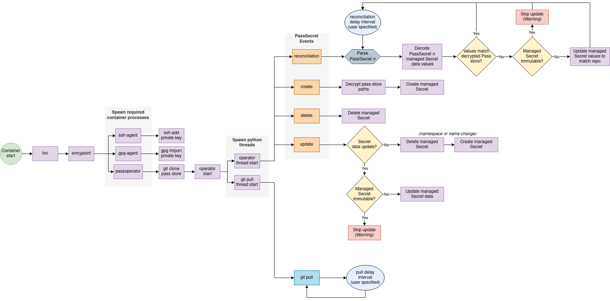

# `pass` secrets operator


A Kubernetes operator to sync and decrypt secrets from a password store ([pass](https://www.passwordstore.org/)) Git repository.

While this approach to secrets management on Kubernetes is more technically challenging, the primary advantage is that we don't have to rely on a 3rd party SaaS platform, such as Vault, Infisical or Doppler, to hold and secure our secrets. This approach upholds a GitOps-style of secrets management by storing encrypted secret state in Git.

Moreover, this operator may be used in an airgapped environment or private subnets (with no outbound Internet access) when paired with any self-hosted git repository that supports SSH access, so your secrets never leave your network.

## How it works

From a high level, this operator runs `git pull` on an interval to grab updates from a git repository populated with encrypted
secrets by `pass` on a local developer's machine. It maps secrets' paths to data values through the application of a [`PassSecret`](helm/operator-crds/templates/PassSecret.yaml), a [custom resource](https://kubernetes.io/docs/concepts/extend-kubernetes/api-extension/custom-resources/), such as the following.

```yaml
apiVersion: secrets.premiscale.com/v1alpha1
kind: PassSecret
metadata:
  name: mypasssecret
  namespace: pass-operator-test
spec:
  encryptedData:
    mykey: premiscale/mydata
  managedSecret:
    metadata:
      name: mysecret
      namespace: mynamespace
    type: Opaque
    immutable: false
```

The above `PassSecret` manifest translates to the following `Secret`.

```yaml
apiVersion: v1
kind: Secret
metadata:
  name: mysecret
  namespace: mynamespace
stringData:
  mykey: <decrypted contents of premiscale/mydata>
immutable: false
type: Opaque
```

The following flowchart outlines how this operator reacts to `PassSecret`-related events and pass store updates.

<p align="center" width="100%">
  
</p>

## Installation

See the [chart README](https://github.com/premiscale/pass-operator/tree/master/helm/operator) for an overview of operator installation and configuration options.

## Development

### Unit tests

Run unit tests with

```shell
yarn test:unit
```

### End-to-end tests

Run e2e tests against a live (local) environment with

```shell
yarn test:e2e
```

This command will

1. Stand up a local 1-node minikube cluster with 4 cores, 4GiB memory and 30GiB storage. *(Modify [./scripts/minikube.sh](./scripts/minikube.sh) if these resources are unsuitable for your local development environment.)*
2. Create a `localhost` docker registry redirect container.
3. Build both e2e (hosts a git repository with encrypted pass secrets that match paths found in [./src/test/data/crd](./src/test/data/crd/)) and operator container images, as well as push these images to the local redirect for minikube to access.
4. Installs both e2e and pass-operator Helm charts.
5. Run e2e tests.
6. Tear down the cluster and local registry, as well as cleans up locally-built artifacts.

### Coverage

Test coverage against the codebase with

```shell
poetry run coverage run -m pytest
poetry run coverage report -m pytest
```
